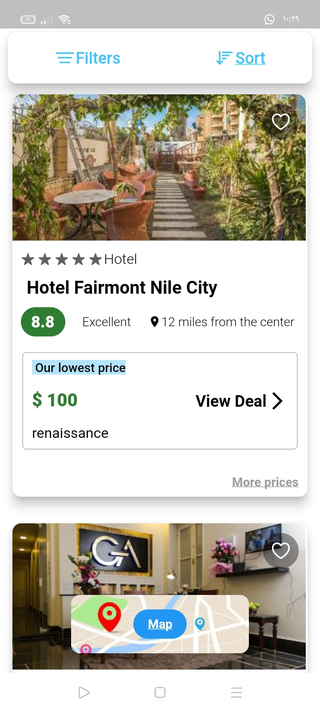
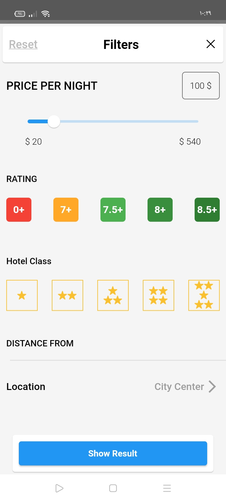
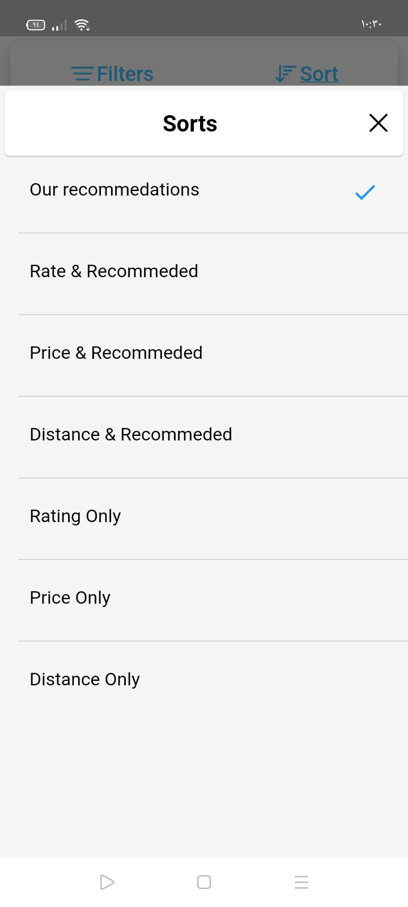
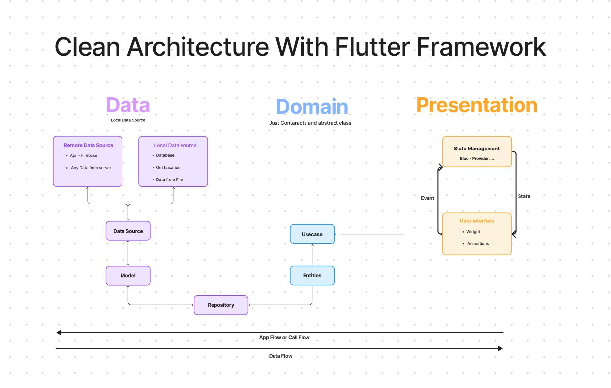

# hotelsgo_assignment


## Overview

This Flutter project, named HotelsGo Assignment, is a mobile application designed to retrieve hotel information from a RESTful API and present it in an easy-to-use format. The app allows users to explore and search for hotels based on various criteria, providing a seamless experience for finding the perfect accommodation.

## Features

- **Hotel Listing**: View a list of available hotels with essential details.
- **Search Functionality**: Search for hotels based on location, amenities, and other criteria.
- **Detailed Hotel Information**: Access detailed information about each hotel, including images, prices, and amenities.
- **User-Friendly Interface**: Intuitive and easy-to-navigate design for a smooth user experience.

## Screenshots


*main Screen*


*Filter Screen*



*Sort Screen*

# HotelsGo Assignment

## Architecture

The HotelsGo Assignment project follows a clean and modular architecture, separating concerns to enhance maintainability and scalability. The architecture is inspired by the Flutter BLoC (Business Logic Component) pattern.

### Architecture Components

1. **Presentation Layer (UI):**
   - Widgets: Responsible for rendering the user interface.
   - Screens: Represent individual screens of the application.
   - controller(state management): Manage the presentation logic.

2. **Domian Layer (contract)**
   - Entitys: models of the data without serialization to the data.
   - BaseRepositories: it will be abstract class to be as contract between data and domain .
   - usecase: it only node which is connect to Presentation Layer.


3. **Data Layer:**
   - dataSource: Communicate with external APIs or databases.
   - Models: inherit from Entitys and make factory to serialized  the data return from API.
   - Repositories: implemantion to BaseRepositories to handle request from data source.

### Architecture Flow



*Clean Architecture With Flutter *


## Getting Started

Follow these steps to run the project locally:

1. Clone the repository:

   ```bash
   git clone https://github.com/MohamedAbdelbaky544/hotelsgo_assignment.git

2. Navigate to the Project Directory:
  
   ```bash
   cd hotelsgo_assignment

3. Install Dependencies:
  
   ```bash
   flutter pub get

4. Run the App:

  ```bash
  flutter run